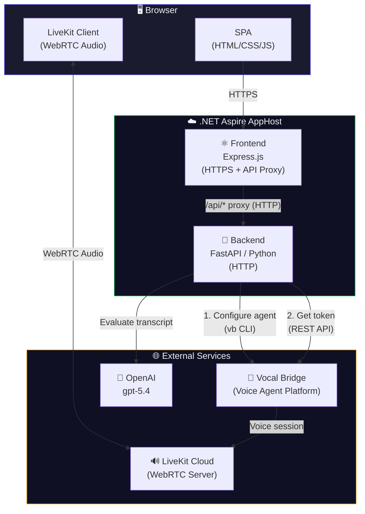
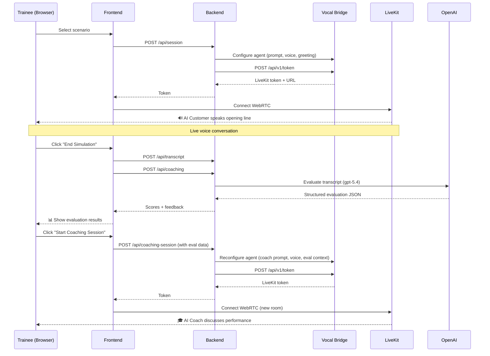

# 🎙 VoiceCoach — AI-Powered Customer Service Training Simulator

VoiceCoach is a voice-based training simulator that uses AI to help customer service representatives practice handling realistic customer interactions. A simulated AI customer engages the trainee in a live voice conversation, then an AI coach evaluates their performance against the company employee manual.

> **Built during a 2-hour hackathon** using [Vocal Bridge](https://vocalbridgeai.com), OpenAI, and .NET Aspire.

## 🎬 Demo

<!-- Replace with your video link -->
[](VIDEO_URL_HERE)

> _Video coming soon_

## Architecture



### Flow



## Features

- **3 training scenarios** with increasing difficulty (Easy → Medium → Hard)
- **Distinct AI customer voices** per scenario using ElevenLabs TTS
- **Live voice simulation** via Vocal Bridge + LiveKit WebRTC
- **AI-powered evaluation** using OpenAI gpt-5.4 with structured JSON scoring
- **8-category scoring rubric** grounded in the employee manual
- **Voice coaching session** — an AI coach discusses your performance after scoring
- **Aspire orchestration** — one command runs everything

## Prerequisites

- [.NET 10 SDK](https://dotnet.microsoft.com/download) (for Aspire)
- [Node.js 18+](https://nodejs.org/) (for the frontend)
- [Python 3.11+](https://www.python.org/) (for the backend)
- [Aspire CLI](https://learn.microsoft.com/dotnet/aspire) (`dotnet tool install -g aspirecli`)
- A [Vocal Bridge](https://vocalbridgeai.com) account and API key
- An [OpenAI](https://platform.openai.com) API key (for transcript evaluation)

## Getting Started

### 1. Clone the repo

```bash
git clone https://github.com/drewby/agentvoicecoach.git
cd agentvoicecoach
```

### 2. Set up the Python backend

```bash
cd src/backend
python -m venv .venv
source .venv/bin/activate   # Windows: .venv\Scripts\activate
pip install -r requirements.txt
cd ../..
```

### 3. Install frontend dependencies

```bash
cd src/frontend
npm install
cd ../..
```

### 4. Generate dev certificates

```bash
mkdir -p tmp
dotnet dev-certs https --export-path tmp/localhost.crt --format PEM
cp tmp/localhost.crt tmp/localhost.key  # Or generate a proper key pair
```

> See [docs/dev-certificates.md](docs/dev-certificates.md) for full instructions on trusting the dev cert in your browser.

### 5. Configure environment variables

```bash
cp .env.example .env
```

Edit `.env` with your API keys:

```env
VB_API_KEY=vb_your_vocal_bridge_api_key
OPENAI_API_KEY=sk-your_openai_api_key
```

| Variable | Required | Description |
|----------|----------|-------------|
| `VB_API_KEY` | Yes | Vocal Bridge API key (starts with `vb_`) — get one at [vocalbridgeai.com](https://vocalbridgeai.com/auth/signup) |
| `OPENAI_API_KEY` | No* | OpenAI API key for gpt-5.4 transcript evaluation. *Without it, mock evaluation data is returned.* |

### 6. Run with Aspire

```bash
cd src/VoiceProject.AppHost
aspire run
```

Aspire will:
- Build and start the Python backend (HTTP)
- Build and start the Express frontend (HTTPS)
- Wire up service discovery and environment variables
- Open the Aspire dashboard

Look for the frontend URL in the output (e.g., `https://localhost:XXXXX`) and open it in your browser.

## Project Structure

```
├── .env.example                 # Environment variable template
├── src/
│   ├── VoiceProject.AppHost/    # .NET Aspire orchestrator
│   │   └── Program.cs           # Resource definitions
│   ├── backend/                 # Python FastAPI backend
│   │   ├── main.py              # API endpoints
│   │   ├── requirements.txt
│   │   └── agents/              # Agent configuration
│   │       ├── simulation_prompt.md
│   │       ├── coaching_prompt.md
│   │       ├── employee_manual.md
│   │       ├── scenarios.json
│   │       ├── config.py
│   │       └── client_actions_*.json
│   └── frontend/                # Express + vanilla JS frontend
│       ├── server.js            # HTTPS server + API proxy
│       └── public/
│           └── index.html       # Single-page application
├── docs/
│   ├── voicecoach-plan.md       # Development plan
│   └── dev-certificates.md      # HTTPS cert setup guide
└── infra/                       # Azure Bicep templates
```

## API Endpoints

| Method | Path | Description |
|--------|------|-------------|
| `GET` | `/api/scenarios` | List available training scenarios |
| `POST` | `/api/session` | Configure VB agent + get LiveKit token for simulation |
| `POST` | `/api/transcript` | Store simulation transcript |
| `POST` | `/api/coaching` | Evaluate transcript via OpenAI gpt-5.4 |
| `POST` | `/api/coaching-session` | Configure VB agent + get token for coaching voice call |

## License

MIT
